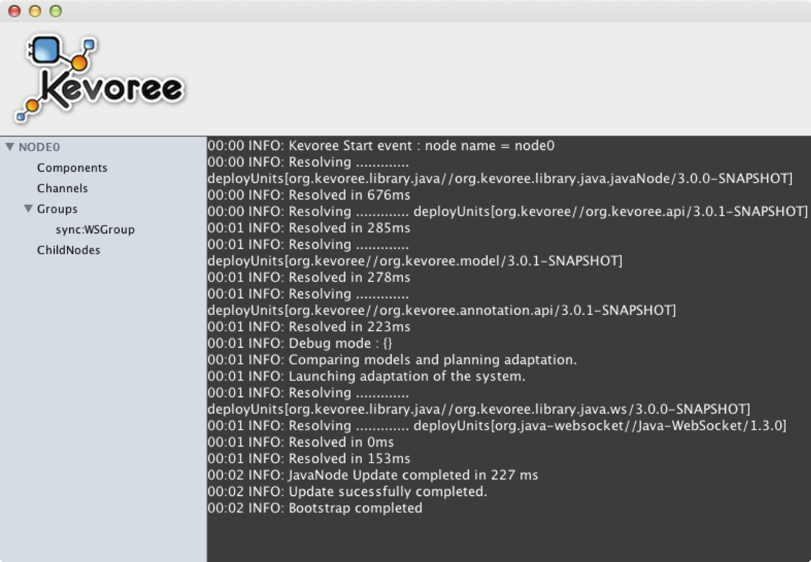

# Start the runtime

Its time to launch a `Runtime`.
You should get a new window as presented in [Figure 1](#fig-runtime).
This window displays, on the **left hand side**, which *components*, *channels* and *groups* are currently instantiated and running.
The **console** will display any *log information* or printing from your components.
All right, the runtime is ready, let launch an `Editor` !

[Figure 1: The Kevoree Java Runtime](id:fig-runtime)

