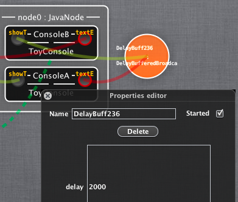

# Using different channels

Now you can try other communication channels. Let's replace the "SyncBroadcast" channel with "DelayBufferedBroadcast" (connect it in the same way like before the SyncBroadcast). When you click on the new channel you can configure the delay property (in milliseconds). For example, let's configure the delay to 2000 milliseconds. Now press again the `Push` button to deploy the scenario. When you now use the "ToyConsole" you should see that messages are delayed by 2000 milliseconds. Another available channel is the "SizeBufferedBroadcast" channel. You can connect this channel similar to the "SyncBroadcast" and "DelayBufferedBroadcast" channels. When you click on the channel you can configure the "bufferSize" property. After deploying you should see that the channel buffers the configured amount of messages before sending. Now let's try the "LoadBalancer" channel. Add a third "ToyConsole" and connect the outputPort of one of the "ToyConsoles" with the "LoadBalancer". Then connect the inputPorts of the two remaining "ToyConsoles" with the "LoadBalancer". Again, press the `Push` button to deploy. You should now see that the output of one of the "ToyConsoles" is each time forwarded to one of the other "ToyConsoles" (normally depending on the load of the components, in this example randomly) but not to both. The last remaining channel to experiment is the "AsyncBroadcast". It works in the same way than the "SyncBroadcast" except that it is asynchronously.

[Figure 5: Changing the communication](id:fig-consoles)

## Let play a bit

Now, I want you to make use of a *ToyOnOffStatusDisplay* to signal that there are answered messages. Make use of one instance of this component per console. The component should display on each time a new message is received in a console; off each time an answer is sent.
