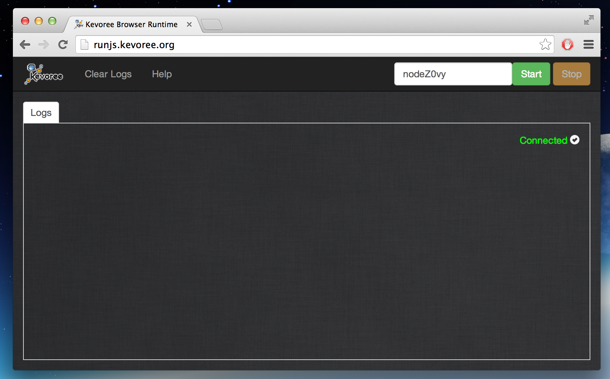
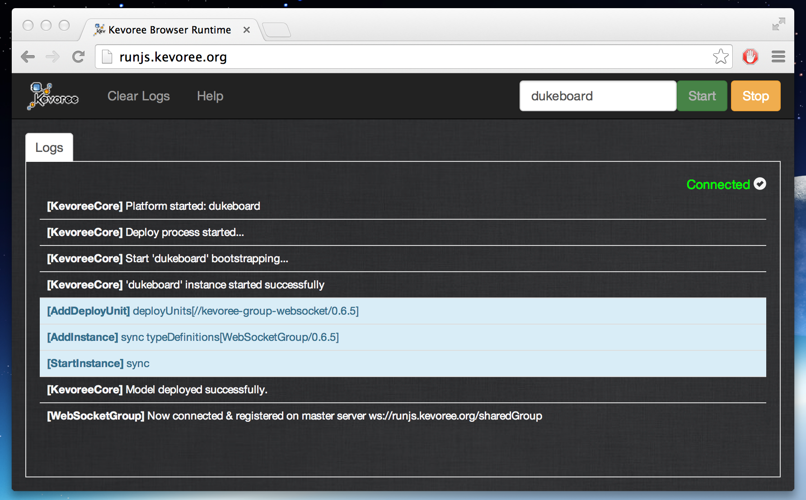
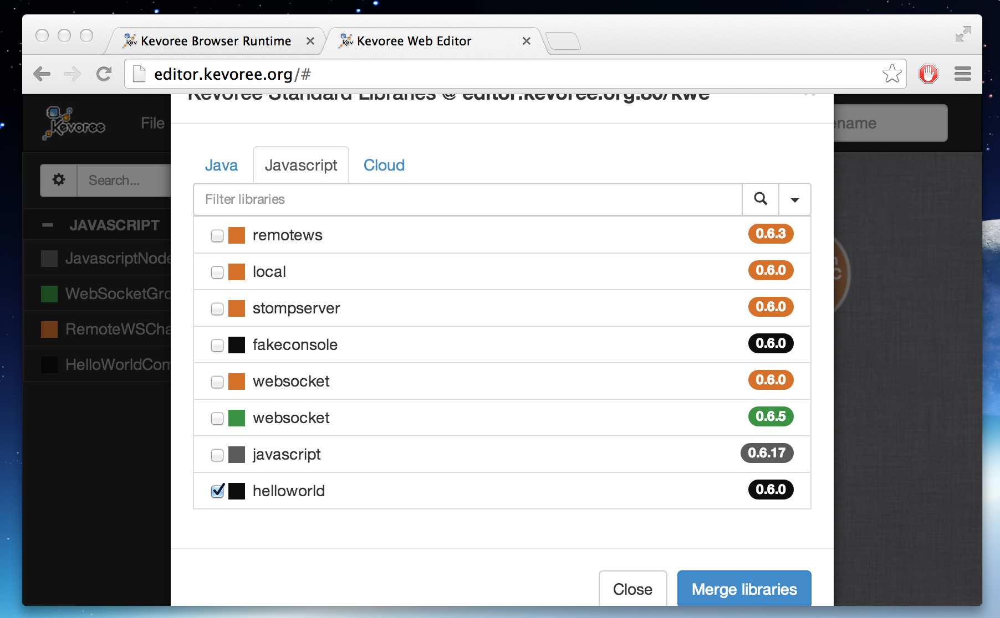
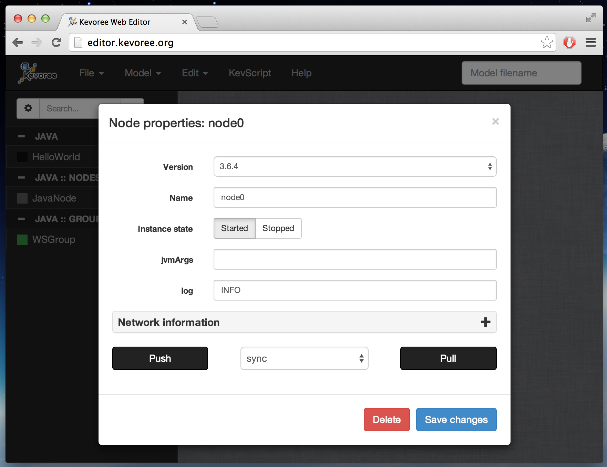
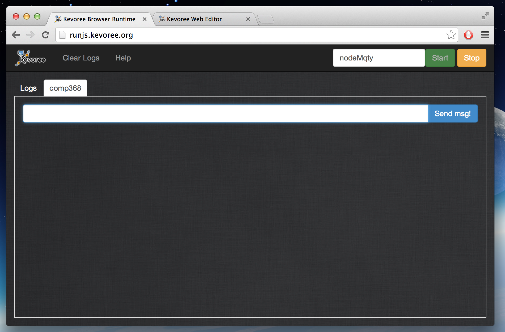
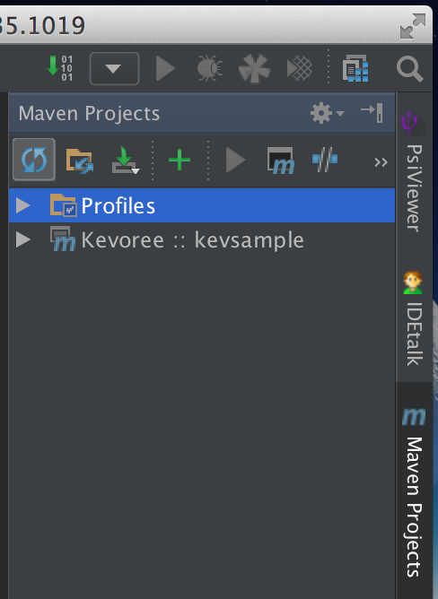
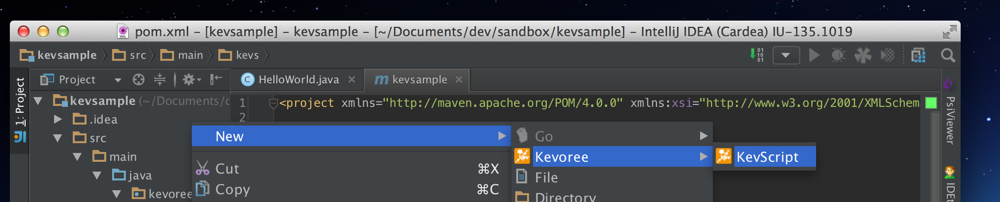
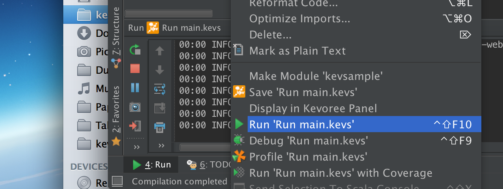

# Kevoree for the impatient

### You want to see something running fast...ok

1. Go to : http://runjs.kevoree.org
    
2. Fill your name and click on start, you will automatically join a public group (!no security)
    
3. Open a tab on: http://editor.kevoree.org/ and load the current model (File > Open from node > RunJS Shared Group > Pull Model)
    
4. Merge a default library through Model > Kevoree Standard Library > JavaScript > fakeconsole > merge
    
5. Drag and drop an HelloWorldComponent on your node (or the one of your neightbour...)
6. Clic on server-node and on push
    
7. You should see a new component in you log
    

### You want to develop your own component, here is a short tutorial to install a developement environement

1. Install JDK8: https://jdk8.java.net/
2. Install IntelliJ IDE : http://www.jetbrains.com/idea/download/
3. Install Kevoree Plugin in IntelliJ (Preferences > Plugins > Browser repositories > Kevoree > Install)
4. Restart IntelliJ
5. Create an Empty Kevoree Project (File > New Project > Kevoree > ok)
    
6. Update the version of Kevoree to desired one
    
7. Eventually refresh maven project if necessary
    
8. Ok you should see a demo component HelloWorld.java
    
9. Create a KevScript file in ***src/kevs***
    
10. Right and run it
    
11. Open Kevoree editor : http://editor.kevoree.org and load the current model (File > Open from node and leave everything by default)
12. Now edit the KevScript file and add the line
```
add node0.hello : HelloWorld
```
13. Run it again, and reload the model, you should see the new component inside the node.
    
14. Now add another HelloWord component using drag and drop and push the new model
    
15. You sould see a message saying that your component has been pushed.

Now feel free to modify the hello world, to connect it to several using default library of channels and so on...
