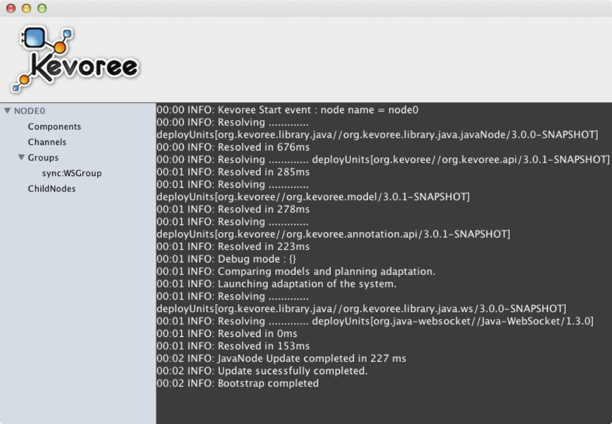
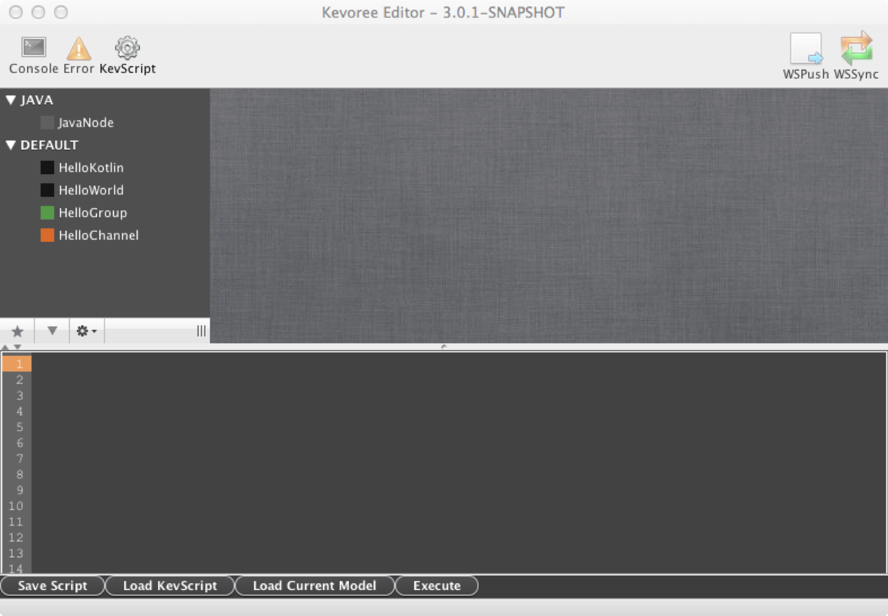
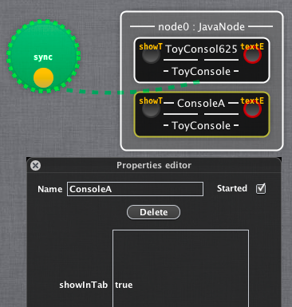
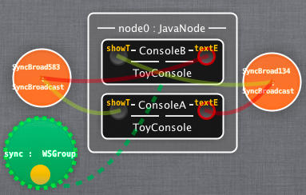
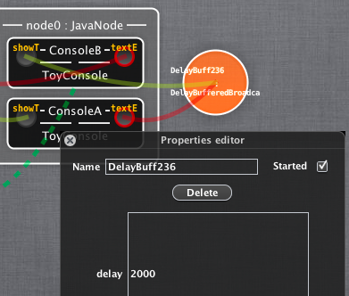

The Kevoree Environment
---------------

### Objectives
This practice aims at making you familiar with the Kevoree environment and basic mechanisms. To this end, you will make use of the Kevoree Editor and the Java Runtime to create a local chat application. 

### Setting up your environment
First of all, you need to have a **Java Runtime Environment 1.7** at least.    
Then browse to the [Kevoree Download Section](http://www.kevoree.org/download "Title") and download the last stable version of the `Kevoree Editor` and the `Kevoree Java Runtime GUI`. To launch them, double-click or command ”java -jar org.kevoree.tools.ui.editor-x.y.z.jar” (replace x,y,z by the current version of Kevoree).

> [Java Runtime w. GUI >](http://oss.sonatype.org/service/local/artifact/maven/redirect?r=public&g=org.kevoree.platform&a=org.kevoree.platform.standalone.gui&v=RELEASE)   
>
> [Kevoree Editor >](http://oss.sonatype.org/service/local/artifact/maven/redirect?r=public&g=org.kevoree.tools&a=org.kevoree.tools.ui.editor&v=RELEASE)

Start the Runtime
---------------

Its time to launch a `Runtime`.    
You should get a new window as presented in [Figure 1](#fig-runtime).    
This window displays, on the **left hand side**, which *components*, *channels* and *groups* are currently instantiated and running.    
The **console** will display any *log information* or printing from your components.    
All right, the runtime is ready, let launch an `Editor` !

> [Figure 1: The Kevoree Java Runtime](id:fig-runtime)
> 

Start the Editor
---------------
Launch the `Editor` (if not already done).    
You should get the window presented in [Figure 2](#fig-editor) (without content for the moment because your model is empty).    
On the *left hand side*, the **library of available component types**. You should have nothing in your editor for the moment, that's ok. We will get some component definitions from existing libraries.    
*On top*, several icons open different panels displaying logs, errors or the Kevoree scripting panel.    
*On the center*, the model edition space.    
Here we go. Let first collect the current model of the runtime we just started. In the editor,
`File / Open From Node`    
By default, the `IP:Port` value is set to collect the model from a group running on the localhost, accessible trough the 9000 port. If you changed the values when you started the runtime, then you have to change this value. Otherwise, proceed.    
The Editor will then get the current model of the runtime, and display it. Once this operation realized, you should see the synchronization group called *sync* (in green), a node called ’node0’ as specified in the runtime startup window, and a green link that indicates that the node0 is part of the *sync* group.    
In the editor, save the model in XMI then in JSON format, and have a look at these files. This is actually what the runtime and the editor are exchanging.    
Ok, you’re ready to create your chat application.

> [Figure 2: The Kevoree Java Editor](id:fig-runtime)
> 

Create & Deploy the application
---------------
### Get the current model
To create the chat application we will use two instances of an existing component. To be able to create an instance, we first need to complete the library of available components. To do so in the Editor,    
`Model / Load Kevoree Library / JAVA / ORG.KEVOREE.{replace by libname}`    
And select the *Channels* and *Toys*. The library of available components, on the left, should fill up with additional components from these libraries.    

### Add two instances
Drag&Drop a component called ”ToyConsole”, two times, from the library to the `node0`. Doing that, you will create two instances of the ToyConsole component type in the model we previously got from the runtime. The actual creation of ToyConsole instances is made by the runtime, in order to fit the new model it receives. Click on the node, and hit the `Push` button at the bottom of the node property windows that shows-up.   
This action pushes the modifier model to the runtime, and you should see the two instances of the ToyConsole component created.    
Now you should have a new window with two tabs. Each tab is an instance of the ToyConsole component. They have been automatically grouped in a single window.    
These consoles are functional (you can type in text), but connected to nothing, so the communication between the two ToyConsole instances is not working. Also, the consoles have generated names, so we may change them.   
Come back in the Editor, and change the names of the consoles’ instances in their properties window (click on the instance).    

> [Figure 3: Adding two consoles](id:fig-consoles)
> 

### Setup the communications
Then we will set up the communication links between the two consoles. The ports of the consoles are Message ports, meaning we have inputPort on the left of a component, and outputPort on the right. Thus what you type in the console prompt will be sent through the output port of the console. For this message to reach the other console, we have to connect the output- Port of one console to the inputPort of the other one.    
Browse the library on the left to find a SyncBroadcast channel (with a orange icon). Drag one in the edition space (not on the node, neither on the component). Then drag the outputPort of the first console to the orange channel instance; drag the inputPort of the second console to the channel instance. You just made your first (one way)connection.    
To do the other way you may use a shortcut: drag the outputPort of the second console and drop it on the inputPort of the first console. Select ”SyncBroadcast” in the windows that prompts for the channel type.    
Time to deploy again. Click on the node, then ’Push’.    
The runtime will adapt the running application accordingly to the new model we just sent.
Now, what you write in one console, arrives in the other.    
Congratulation. You just deployed your first application using Model@Runtime. If you want to check that the model is really available at runtime, close your editor, launch it again and open the model from the node. You’ll get the same model as you sent the last time.    

> [Figure 4: Adding two channels](id:fig-consoles)
> 

### Using different communication channels
Now you can try other communication channels. Let's replace the "SyncBroadcast" channel with "DelayBufferedBroadcast" (connect it in the same way like before the SyncBroadcast). When you click on the new channel you can configure the delay property (in milliseconds). For example, let's configure the delay to 2000 milliseconds. Now press again the `Push` button to deploy the scenario. When you now use the "ToyConsole" you should see that messages are delayed by 2000 milliseconds. Another available channel is the "SizeBufferedBroadcast" channel. You can connect this channel similar to the "SyncBroadcast" and "DelayBufferedBroadcast" channels. When you click on the channel you can configure the "bufferSize" property. After deploying you should see that the channel buffers the configured amount of messages before sending. Now let's try the "LoadBalancer" channel. Add a third "ToyConsole" and connect the outputPort of one of the "ToyConsoles" with the "LoadBalancer". Then connect the inputPorts of the two remaining "ToyConsoles" with the "LoadBalancer". Again, press the `Push` button to deploy. You should now see that the output of one of the "ToyConsoles" is each time forwarded to one of the other "ToyConsoles" (normally depending on the load of the components, in this example randomly) but not to both. The last remaining channel to experiment is the "AsyncBroadcast". It works in the same way than the "SyncBroadcast" except that it is asynchronously.     

> [Figure 5: Changing the communication](id:fig-consoles)
> 

Let play a bit
---------------

Now, I want you to make use of a *ToyOnOffStatusDisplay* to signal that there are answered messages. Make use of one instance of this component per console. The component should display on each time a new message is received in a console; off each time an answer is sent.

