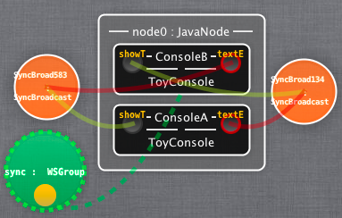

# Link components to setup communications

Then we will set up the communication links between the two consoles. The ports of the consoles are Message ports, meaning we have inputPort on the left of a component, and outputPort on the right. Thus what you type in the console prompt will be sent through the output port of the console. For this message to reach the other console, we have to connect the output- Port of one console to the inputPort of the other one.    
Browse the library on the left to find a SyncBroadcast channel (with a orange icon). Drag one in the edition space (not on the node, neither on the component). Then drag the outputPort of the first console to the orange channel instance; drag the inputPort of the second console to the channel instance. You just made your first (one way)connection.    
To do the other way you may use a shortcut: drag the outputPort of the second console and drop it on the inputPort of the first console. Select ”SyncBroadcast” in the windows that prompts for the channel type.    
Time to deploy again. Click on the node, then ’Push’.    
The runtime will adapt the running application accordingly to the new model we just sent.
Now, what you write in one console, arrives in the other.    
Congratulation. You just deployed your first application using Model@Runtime. If you want to check that the model is really available at runtime, close your editor, launch it again and open the model from the node. You’ll get the same model as you sent the last time.    

[Figure 4: Adding two channels](id:fig-consoles)

